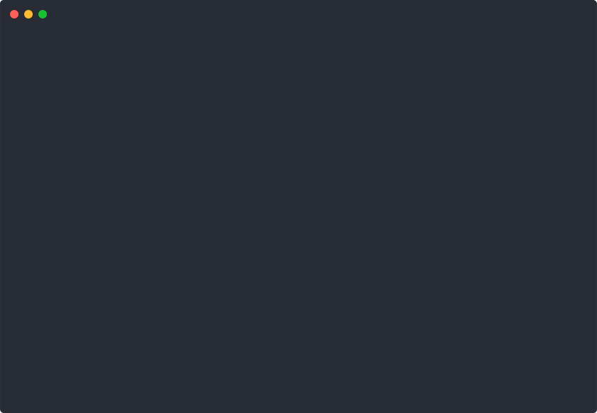

# progress.h

A dead simple C progress bar



> The glitch where the bar shortens at the end is due to the preview and not present in real world use.

## About

`progress.h` is a single header, minimal progress bar library in C. Just copy it to your project, include it in your C files and you're ready to go.

## Usage

```c
#include <stdio.h>
#include "progress.h"

int main() {
    for (unsigned int i = 0; i <= 100; i++) {
        progress_print(i, 100);
    }
}
```

This is the most basic use. It will show the default progress bar going from 0 to 100%, really fast. You just need to pass the current value and the max possible value to the `progress_print`. The result would look like this:

```text
[####################] 100%
```

Of course, you can customize the look of the progress bar:

```c
// ...
progress_printf(i, 100, "[=> ]", 10, 0);
// ...
```

```text
[=========>]
```

You now use the `progress_printf` function. You still pass the current and max values, but add a format string, a length and specify if you want to show percentage or not. The format string consists of a left delimiter, a character to use for completed progress, a character to use as the current progress level, a character to use for uncompleted progress and a right delimiter. Delimiters do not count in as length, and neither does the percentage. You can also omit the delimiters to not have them be printed:

```c
// ...
progress_printf(i, 100, "=> ", 10, 0);
// ...
```

```text
=========>
```

For a complete example (the one used in the preview), see [`example.c`](example.c).

## How it works

It just prints the current progress to stderr over the old one using the carriage return character. By default, the carriage return is placed at the beginning of the progress bar, which means you can only print text at the end of the progress bar. If you want to print text before it, use `progress_rprint` or `progress_rprintf`.
